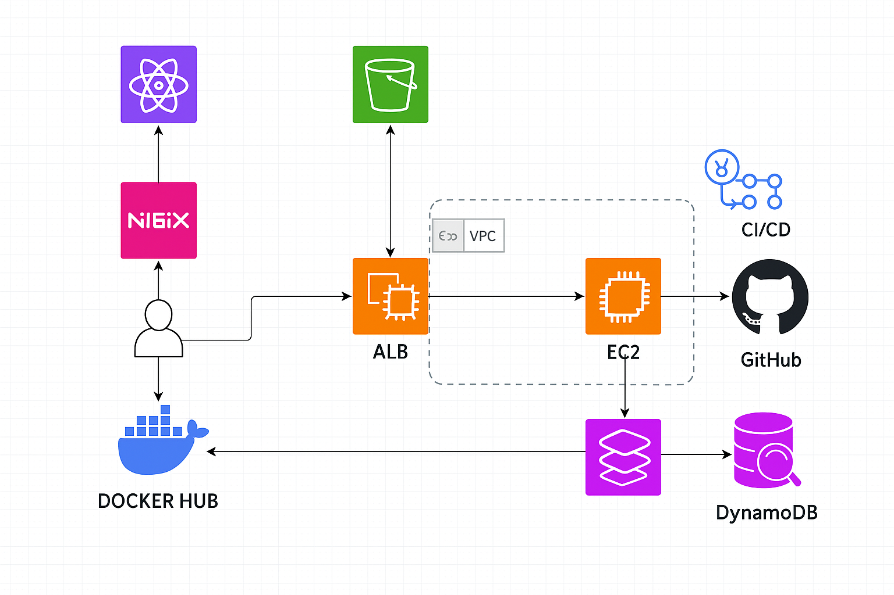

# 🚀 Cloud DevOps Todo App

Application de gestion de tâches déployée automatiquement sur AWS avec **Terraform**, **Docker**, **ECS Fargate**, **CloudWatch Logs** et **GitHub Actions**.  
Projet réalisé dans le cadre du module *Cloud DevOps - IIM*.

---

## 🏗️ Architecture



---

## 🔧 Stack Technique

- **Frontend** : React + Vite + Nginx (`client/`)
- **Backend** : Node.js (Express) — API REST (`server/`)
- **Base de données** : DynamoDB (AWS NoSQL)
- **Infrastructure** : ECS Fargate, ALB, VPC, IAM, CloudWatch Logs, S3
- **CI/CD** : GitHub Actions (`.github/workflows/*.yml`)
- **Conteneurisation** : Docker + DockerHub
- **Infrastructure as Code** : Terraform (`infra/`)

---

## ✨ Fonctionnalités

- ✅ CRUD de tâches via API REST
- ✅ Interface utilisateur frontend React
- ✅ Sauvegarde des données dans DynamoDB
- ✅ Health check `/health` exposé par le backend
- ✅ Déploiement automatisé sur AWS via GitHub Actions
- ✅ Logs ECS centralisés avec CloudWatch Logs

---

## ⚙️ Infrastructure AWS déployée

| Ressource         | Détails techniques                                       |
|-------------------|----------------------------------------------------------|
| `VPC`             | Réseaux publics et privés (`network.tf`)                |
| `ECS Cluster`     | Déployé via Fargate (`ecs.tf`)                          |
| `ALB`             | Application Load Balancer (`alb.tf`)                    |
| `Task Definitions`| Utilisent les images DockerHub du client & backend      |
| `Services ECS`    | 2 services (frontend + backend)                          |
| `DynamoDB`        | Table NoSQL pour les tâches (`dinamodb.tf`)             |
| `CloudWatch Logs` | Collecte des logs des conteneurs (`logs.tf`)            |
| `S3`              | Backend Terraform (`terraform-backend/backend.yaml`)    |
| `IAM`             | Rôles et politiques de sécurité (`iam.tf`)              |

---

## 🚀 CI/CD Pipeline (GitHub Actions)

Automatisation complète à chaque PR vers `main` :

1. 🧪 **Build & Test**
2. 🐳 **Build & Push des images Docker vers DockerHub**
3. 📦 **Vérification de l’existence du bucket S3**
4. ⚙️ **Déploiement automatique de l'infrastructure via Terraform sur AWS**

> Les URLs publiques seront affichées dans les logs GitHub Actions.

### 📂 Fichiers GitHub Actions

```bash
.github/workflows/
├── ci.yml         # Étapes CI : build & test
├── deploy.yml     # Push des images Docker
└── cd.yml         # Déploiement Terraform
```

## 🔐 Configuration requise (Secrets GitHub Actions)

Définis ces secrets dans `Settings > Secrets > Actions` :

| Nom du secret           | Description                    |
|-------------------------|--------------------------------|
| `DOCKER_USERNAME`       | Ton identifiant Docker Hub     |
| `DOCKER_PASSWORD`       | Ton mot de passe Docker Hub    |
| `AWS_IAM_ROLE	`         | Rôle IAM AWS                   |


## ⚡ Déploiement manuel (en local)

### Si le bucket S3 existe déjà :

```bash
cd infra/
terraform init
terraform plan
terraform apply


# Si le bucket S3 n’existe pas encore :
 terraform-backend/backend.yaml

 Et tu peux l'initialiser via le script bash :

 terraform-backend/deploy.sh

---

### 📈Observabilité (CloudWatch Logs)

```md
## 📈 Observabilité

- Tous les logs ECS (client + serveur) sont envoyés dans **CloudWatch Logs**
- Une route `/health` est présente pour les **health checks** du Load Balancer vers le backend

## ✅ Tests réalisés

```bash
📮 API backend : GET /tasks, POST /tasks, GET /tasks/:id, etc.

🌐 Frontend React accessible via Load Balancer

🧾 Données bien enregistrées dans DynamoDB

🔍 Application testée dans un vrai navigateur (pas localhost)

---


## 🧹 Nettoyage complet du projet

```bash
# Supprimer l’infrastructure AWS

cd infra/
terraform destroy

Et supprimer ensuite manuellement le backend :

rm -rf terraform-backend/

---


## 📦 Structure du projet

deploy-terraform-cd/
├── client/                      # Frontend React (Vite + Nginx)
│   ├── Dockerfile, vite.config.js, nginx.conf, ...
│   └── src/
├── server/                      # Backend Express
│   ├── index.js, todoManager.js, ...
│   └── Dockerfile
├── infra/                       # Infrastructure Terraform
│   ├── ecs.tf, alb.tf, cloudfront.tf, ...
│   └── network.tf, main.tf, outputs.tf, etc.
├── terraform-backend/          # Backend de Terraform
│   ├── backend.yaml
│   └── deploy.sh
├── .github/workflows/          # CI/CD GitHub Actions
│   ├── ci.yml, deploy.yml, cd.yml
└── docker-compose.yml          # Lancement local


## 🧪 Lancer le projet en local

```bash
docker-compose -f docker-compose.yml up --build

---
